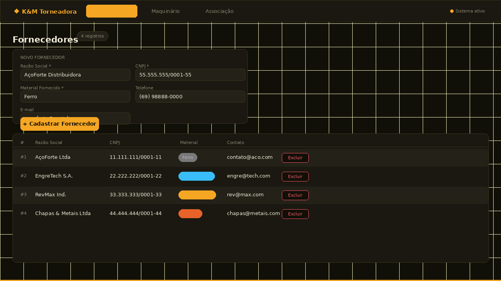

# K&M Torneadora — Sistema de Controle de Estoque

Projeto Integrador Full Stack | Gran Faculdade



## Sobre a Empresa Cliente

**Razão Social:** F M de H Sales
**Nome Fantasia:** K&M Torneadora, Serv de Torno, Solda e Garimpo em Geral
**CNPJ:** 12.080.762/0001-24
**Porte:** Micro Empresa
**Fundação:** 14/06/2010
**Segmento:** Fabricação e manutenção de maquinário para garimpo

### Contexto do Negócio

A K&M Torneadora fabrica equipamentos sob encomenda para garimpeiros da região.
Os principais clientes são garimpeiros que encomendam maquinários pesados.
Os fornecedores abastecem a empresa com matéria-prima: ferro, engrenagens, revestimento e chapas.

### Equipamentos Fabricados

| Equipamento | Categoria    | Descrição |
|-------------|-------------|-----------|
| Draga       | Extração    | Extração de minério em leitos de rios |
| Maraca      | Extração    | Bomba de sucção para áreas alagadas |
| Guincho     | Içamento    | Movimentação de cargas pesadas |
| Abacaxi     | Perfuração  | Perfuração em solo duro |
| Lança       | Hidráulico  | Desmonte hidráulico de barranco |

### Fornecedores Cadastrados

| Fornecedor          | Material Fornecido |
|---------------------|--------------------|
| AçoForte Ltda       | Ferro              |
| EngreTech S.A.      | Engrenagens        |
| RevMax Ind.         | Revestimento       |
| Chapas & Metais Ltda| Chapas             |

---

## Tecnologias

- **Backend:** Node.js + Express
- **Frontend:** React.js + Vite

## Funcionalidades

- Cadastro de Fornecedores com tipo de material fornecido
- Cadastro de Maquinário com categoria e preço de fabricação
- Associação de Fornecedor a Equipamento
- Alerta visual para equipamentos sem fornecedor vinculado

## Como Rodar

### Backend

```bash
cd backend
npm install
npm start
```
Servidor em `http://localhost:3001`

### Frontend

```bash
cd frontend
npm install
npm run dev
```
App em `http://localhost:3000`

## Histórias de Usuário (BDD)

```gherkin
Feature: Cadastro de Fornecedor
  Dado que acesso a página de fornecedores
  Quando preencho nome, CNPJ e material fornecido e clico em Cadastrar
  Então o fornecedor aparece na lista com o material destacado

Feature: Cadastro de Maquinário
  Dado que acesso a página de maquinário
  Quando preencho nome, categoria, preço e quantidade e clico em Cadastrar
  Então o equipamento aparece na lista de estoque

Feature: Associação Fornecedor → Equipamento
  Dado que existem fornecedores e equipamentos cadastrados
  Quando seleciono uma Draga e o fornecedor de Chapas e clico em Vincular
  Então a Draga exibe o fornecedor de Chapas como responsável pelo material
```

## Rotas da API

| Método | Rota                   | Descrição                          |
|--------|------------------------|------------------------------------|
| GET    | /fornecedores          | Lista fornecedores                 |
| POST   | /fornecedores          | Cadastra fornecedor                |
| DELETE | /fornecedores/:id      | Remove fornecedor                  |
| GET    | /produtos              | Lista equipamentos                 |
| GET    | /produtos/categorias   | Lista categorias disponíveis       |
| POST   | /produtos              | Cadastra equipamento               |
| DELETE | /produtos/:id          | Remove equipamento                 |
| POST   | /associacao            | Vincula fornecedor a equipamento   |
| DELETE | /associacao/:produtoId | Remove vínculo                     |
